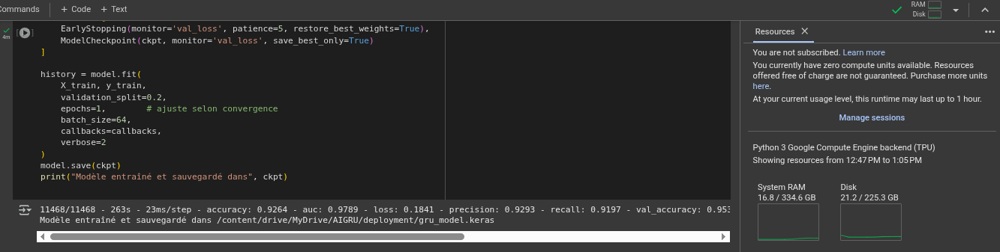
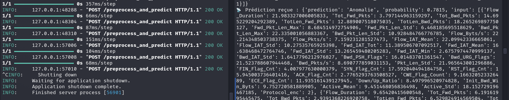
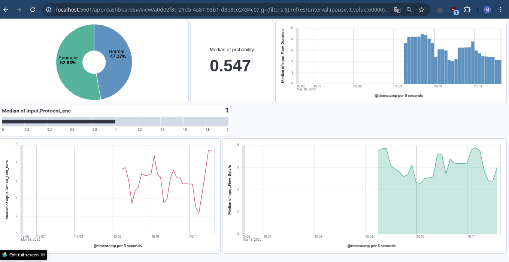

# DeepSec-GRU-IDS

**Final Project Report**

## Table of Contents

1. [Introduction](#introduction)
2. [Project Context](#project-context)
3. [System Architecture](#system-architecture)
4. [Implementation Details](#implementation-details)
   - [Data Preprocessing](#data-preprocessing)
   - [Model Training](#model-training)
   - [API & Deployment](#api--deployment)
5. [Results & Performance](#results--performance)
6. [Conclusion](#conclusion)
7. [Project Credits](#project-credits)
8. [GitHub Publishing](#github-publishing)

---

## Introduction

This project introduces **DeepSec-GRU-IDS**, a deep learning–based Intrusion Detection System (IDS) utilizing a Gated Recurrent Unit (GRU) network to detect network anomalies in real time. The pipeline covers data preprocessing, model training on Google Colab, and deployment via FastAPI alongside a logging and visualization stack.

## Project Context

- **Course:** Ingénierie Informatique, Cybersécurité et Confiance Numérique  
- **Presented by:** Mohamed El Ghazi  
- **Supervised by:** Pr. Soufiane Hamida  
- **Module:** AI and Cybersecurity (Capstone Project)

## System Architecture

1. **Data Processing & Model Training** (Google Colab)  
2. **Inference API** (FastAPI on Python 3.10 venv)  
3. **Logging & Visualization** (Logstash → Elasticsearch → Kibana)

---

## Implementation Details

### Data Preprocessing

- Load dataset from CSV and drop irrelevant fields  
- Remove constant columns and handle infinite/NaN values by median imputation  
- Encode labels and protocols with `LabelEncoder`  
- Drop highly correlated features (threshold 0.85)  
- Scale features (`StandardScaler`) and create sequences of length 10

### Model Training

- **Environment:** Google Colab with up to **19 GB** RAM  
- **Model:** Two-layer GRU (128 → 64 units) with Dropout and Dense heads  
- **First Epoch Metrics:** Validation accuracy ≈ 92.64 %, AUC ≈ 0.979  
- Save artifacts: `gru_model.keras`, `scaler.pkl`, encoders, `features.json`

**Google Colab Resources:**

### API & Deployment

- **Framework:** FastAPI running in a Python 3.10 virtual environment  
- **Endpoint:** `/preprocess_and_predict` (accepts JSON array of 10 packet feature dicts)  
- **Logging:** Sends JSON prediction logs via TCP to Logstash on port 5000

**Prediction Terminal Output:**

### Logging & Visualization

- **Visualization:** Kibana dashboard for real-time log monitoring

---

## Results & Performance

- **Test Accuracy:** 95 %  
- **Precision/Recall:** ~ 95 %  
- **ROC-AUC:** ~ 0.990  

Real-time traffic generator validated system throughput and log integration.

---

## Conclusion

DeepSec-GRU-IDS demonstrates a robust, end-to-end IDS solution combining sequence-based deep learning with real-time log analytics. The project highlights efficient preprocessing, effective GRU performance, and seamless deployment in a cybersecurity context.

---

## Project Credits

**Presented by:** Mohamed El Ghazi  
**Supervised by:** Pr. Soufiane Hamida  
**Course:** Ingénierie Informatique, Cybersécurité et Confiance Numérique  
**Project:** Capstone in AI & Cybersecurity